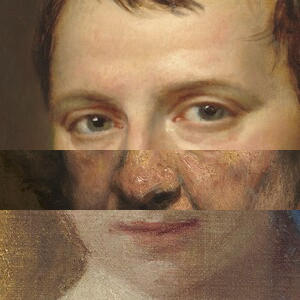
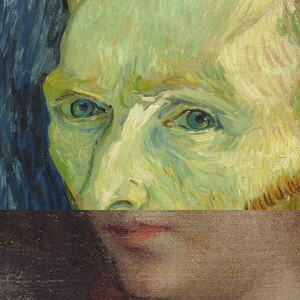
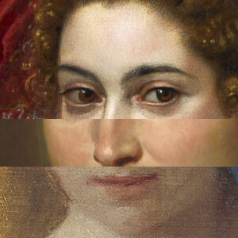

# Files for the IIIF Workshop at Coding da Vinci Ost 2018 in Leipzig, Germany

https://codingdavinci.de/events/ost/

Leander Seige, seige@ub.uni-leipzig.de

   

## Instructions:

Just run the jupyter notebook.

## Sources:

This distribution contains HAAR files from the OpenCV library: https://opencv.org/ (BSD License)

This distribution contains a sample HTML/Javascript game derived from https://stackoverflow.com/questions/29329698/html5-memory-game-javascript-function by Cody Taylor (CC-BY-SA, according to Stackoverflows Terms of Service)

